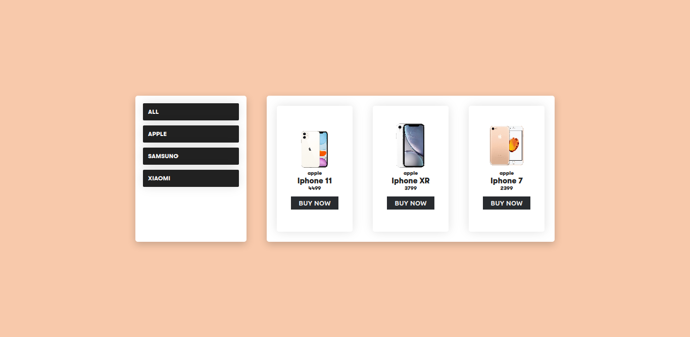

# day-25-in-30-days-of-react 

- in this project i make the most basic part of an e-commerce, an item filter, but it was something interesting, little by little understanding more about basic functions of javascript, such as the use of filters in arrays 

# result image  

